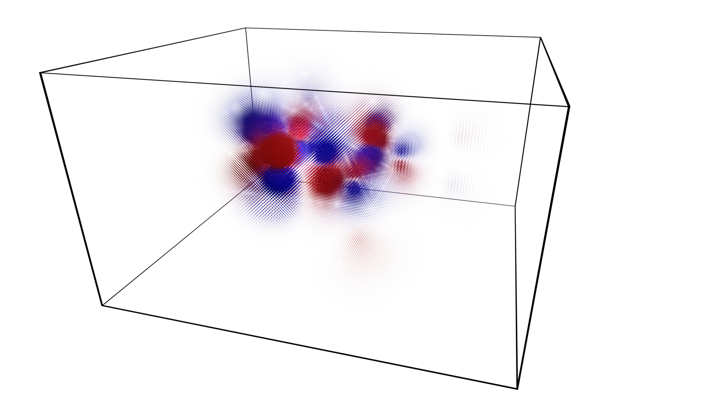

Cubefile
========

Cube files are generated from quantum mechanical chemistry calculations.
They contain data about the atoms of a molecule: their element, charge and position. 

This package contains a single module for processing cube files. Example usage:

.. code-block:: python

   >>> import Cubefile
   >>> cf = Cubefile.Cubefile("_testfiles/caffeine_54.cube")
   >>> cf.voxels.shape
   (111, 98, 64)

The `_testfiles` directory includes selected cube files of
molecular orbitals calculated for caffeine at B3LYP/6-31G(d) using the
`psi4  <https://psicode.org/psi4manual/master/cubeprop.html>`_
computational chemistry program.

The above file can be rendered as a point cloud, 
with red representing positive values;
blue representing negative values and
points scaled by a factor of 3.0.

Cubefile file format reference: `http://paulbourke.net/dataformats/cube/
<http://paulbourke.net/dataformats/cube/>`_.

.. automodule:: Cubefile.Cubefile
   :members:
   

.. toctree::
   :maxdepth: 2
   :caption: Contents:

